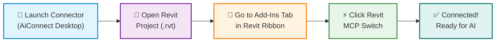

# Autodesk Revit Connector — Setup & Usage Guide

The **Autodesk Revit Connector** connects your AI assistants (Antigravity, Claude, Cursor) directly to **Autodesk Revit (2023, 2024, 2025, and 2026)** to inspect models, extract BIM data, and automate design workflows in real time.

---

## 1. Quick Connection Flow

---

## 2. Prerequisites

- **Operating System**: Windows 10 or Windows 11 (64-bit).
- **Autodesk Revit**: 2023, 2024, 2025, or 2026 installed.
- **AiConnect Desktop**: Installed and running.
- **Active Model**: An open Revit project (`.rvt`) or project template.

---

## 3. Step-by-Step Connection

### Step 1: Launch the Connector
1. Open **AiConnect Desktop**.
2. Navigate to **MCP Collection** (or **Connectors**).
3. Find **Revit Connector** and click **Install** (if not yet installed), then click **Connect**.
4. The connector status will display `Waiting for Host`.

### Step 2: Open Autodesk Revit
1. Launch your installed version of **Autodesk Revit** (2023–2026).
2. If prompted with a security dialog regarding the add-in:
   - Choose **"Always Load"**.
3. Open any existing project (`.rvt`) or create a new model.

### Step 3: Enable the Revit MCP Switch
1. In Revit, navigate to the **Add-Ins** tab in the top ribbon menu.
2. Locate the **Revit MCP Plugin** ribbon panel.
3. Click the **Revit MCP Switch** button.
4. A notification will confirm that the connection listener is active.

### Step 4: Verify Connection
1. Return to **AiConnect Desktop**.
2. The Revit Connector status badge will turn to **`● Connected`**.
3. Your AI agent is now ready to assist with your active Revit model.

---

## 4. What Your AI Agent Can Do

Once connected, your AI assistant can interact with the live Revit project to:

- **Inspect Model Elements**: Query active views, inspect selected elements, examine category hierarchies, and retrieve parameter values.
- **Analyze Statistics & Quantities**: Extract material takeoffs, analyze room areas and volumes, and summarize project metrics.
- **Automate Modeling**: Create and position architectural and structural elements such as walls, beams, columns, doors, windows, grids, and levels.
- **Manage Parameters & Properties**: Read and update instance and type parameters across families.
- **Coordinate Views & Visuals**: Highlight, filter, or color-code elements dynamically for design review.

---

## 5. Troubleshooting & FAQ

- **Status remains "Waiting for Host"**:
  - Verify that Autodesk Revit is running and an active project (`.rvt`) is open.
  - Make sure you clicked the **Revit MCP Switch** button under the **Add-Ins** ribbon tab.
- **Revit Security Prompt on Startup**:
  - When Revit asks whether to load `mcp-servers-for-revit`, select **"Always Load"** so the add-in loads seamlessly every time.
- **Missing Ribbon Button**:
  - Ensure the add-in was installed from AiConnect Desktop. If Revit was already open during installation, restart Revit to load the new ribbon tab.
